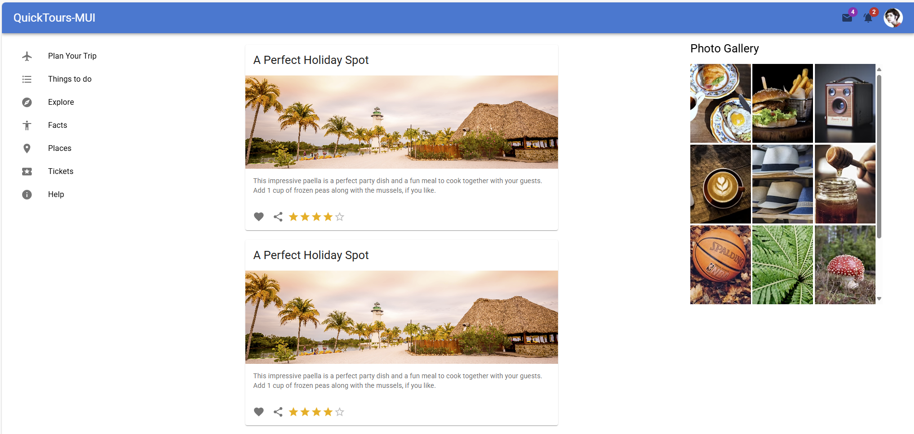
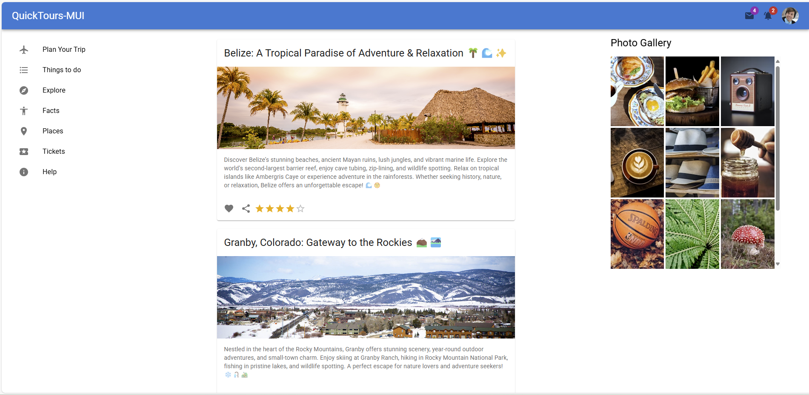
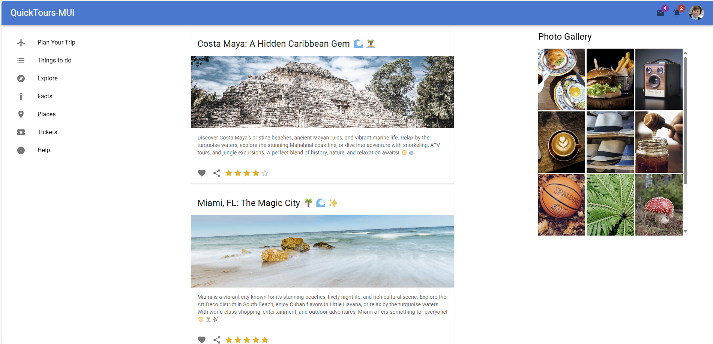
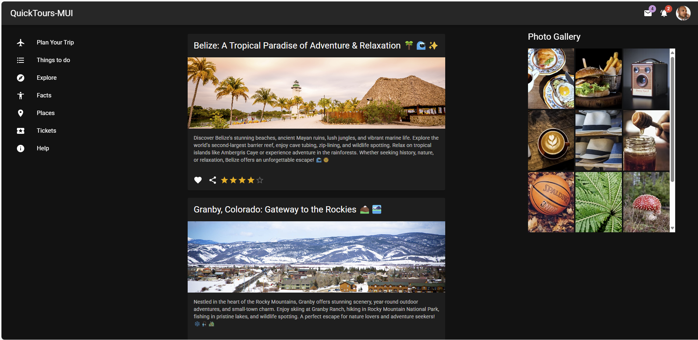

## Tour Site with React and Material UI

This template provides a minimal setup to get React working in Vite with HMR and some ESLint rules.

## Go to Project Directory and run the below command
npm install

## Install Material UI by below command

npm install @mui/material @emotion/react @emotion/styled

## Install Material UI Icons by below command

npm install @mui/icons-material

## Start the project

npm run dev

## Test the project
localhost:port/

Currently, two official plugins are available:

- [@vitejs/plugin-react](https://github.com/vitejs/vite-plugin-react/blob/main/packages/plugin-react/README.md) uses [Babel](https://babeljs.io/) for Fast Refresh
- [@vitejs/plugin-react-swc](https://github.com/vitejs/vite-plugin-react-swc) uses [SWC](https://swc.rs/) for Fast Refresh

## Home Page

## Dark Theme
